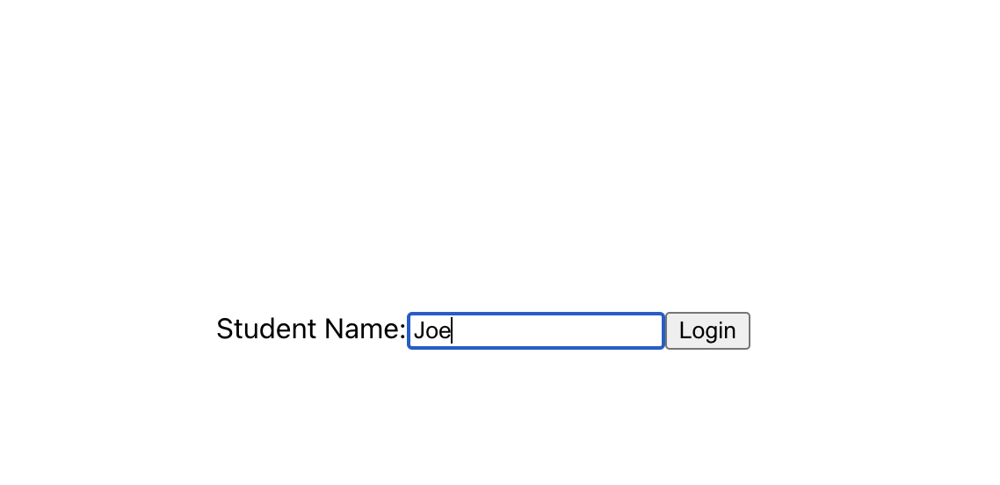
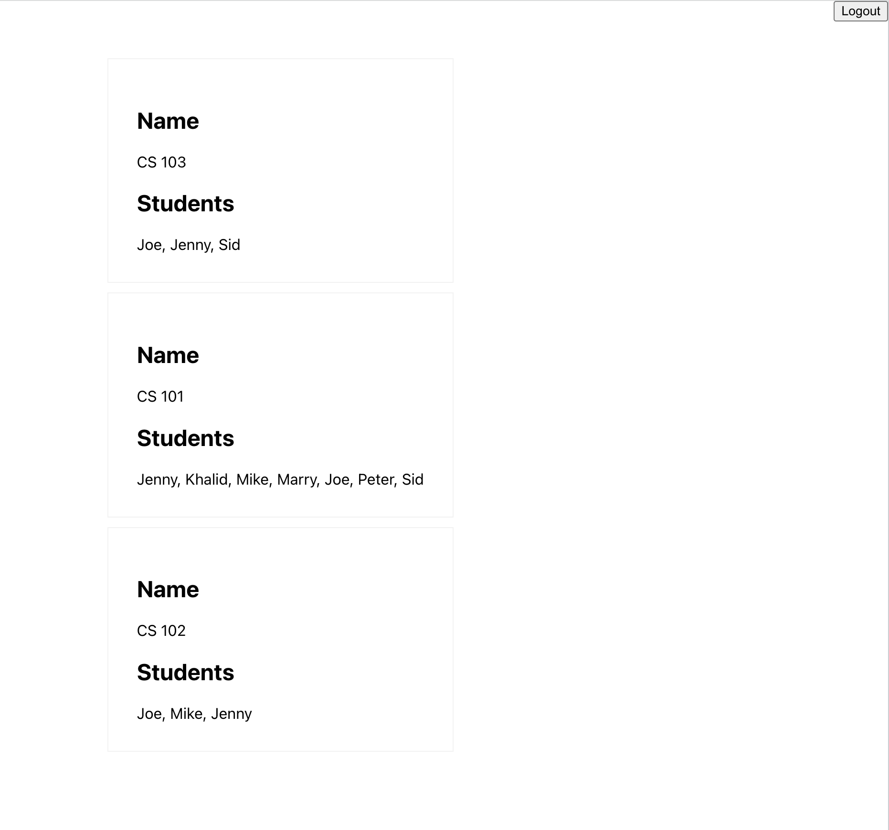

# React App with Airtable Data

Here is the Link to Airtable data: https://airtable.com/app8ZbcPx7dkpOnP0

* There are two tables: Students & Classes
* We're trying to List all the classes of a student searched by a user as shown below
* Need to filter data by Formulas, all queries are listed in `src/api/ClassesAPI.js` file
* Both tables are interlinked which made queries a little tricky
* Airtable complex Joins implemented by JS functionalities. We were required to only make 2 Api calls, not more than that.

## How to Run it
* Download the repo && `cd react-airtable`
* `npm install`
* create a `.env` file in root folder of this project
* Add an environment variable `REACT_APP_AIRTABLE_API_KEY=` and Paste your Airtable account key here. This variable is required in `src/api/ClassesAPI.js` file
* Now simply run `npm start` command.

  
